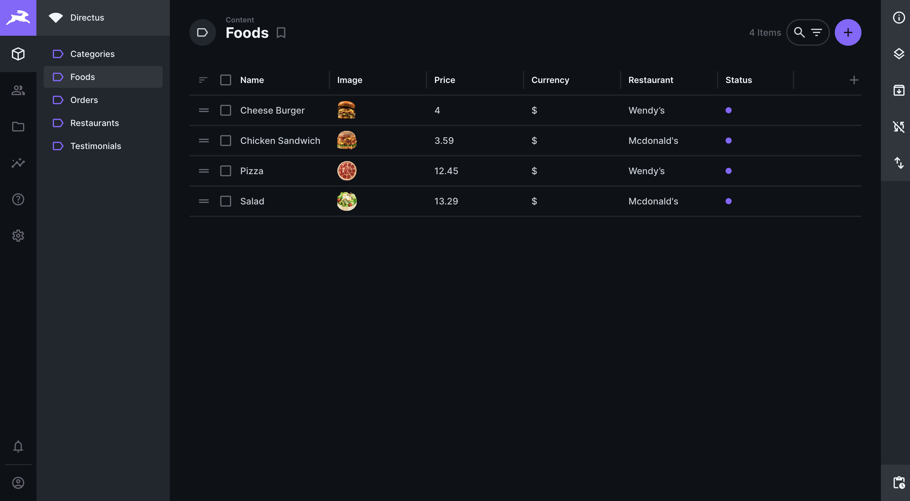

# Food Delivery backend

This application provides a backend solution for a meal delivery project. This backend is built using Directus, a powerful headless Node.js framework that serves as the API

## Features

- **User Authentication**: Secure registration, login, and authentication token management.
- **Restaurant Management**: Create, update, and categorize restaurant listings.
- **Menu Management**: Create, update, and categorize menus and menu items.
- **User Reviews**: Allow users to leave comments and reviews for restaurants.
- **Order Processing**: Process and manage customer orders, including order creation, status tracking, and payment processing.

## Preview



## Requirements

- Docker
- Node.js
- npm

## Installation

Clone the repository to your local machine:

```bash
git clone [URL_REPO_GIT]
cd [PROJECT]
```

Config the admin email and password in docker-compose.yml

```yaml
version: '3'
services:
  directus:
    image: directus/directus:latest
    ports:
      - 8055:8055
    volumes:
      - ./database:/directus/database
      - ./uploads:/directus/uploads
    environment:
      KEY: 'randomkey'
      SECRET: 'randomsecret'
      ADMIN_EMAIL: 'spencer@gmail.com'
      ADMIN_PASSWORD: 'directus'
      DB_CLIENT: 'sqlite3'
      DB_FILENAME: '/directus/database/data.db'
      WEBSOCKETS_ENABLED: true
```

Run project

```docker
docker compose up
```

Use

**Go to the address 0.0.0.0:[PORT]**

## License

Released under the MIT License. Feel free to use, modify, and distribute this project according to the terms of the license.